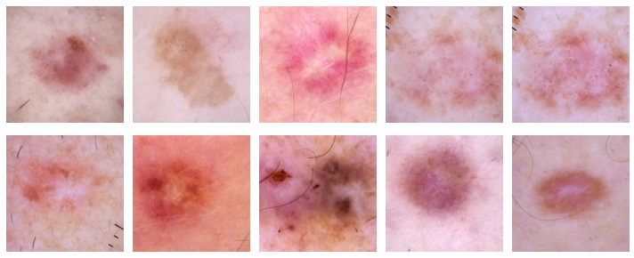

# SKIN DISEASE CLASSICICATION USING METADATA

| Some skin disease image |
| ---------- |
| |

## 9 classes
|Melanoma (MEL)|
| ---------- |
||
|Actinic Keratosis (AK)|
| ---------- |
||
Basel Cell Carcinoma (BCC)
| ---------- |
||
Benign Keratosis (BK)
| ---------- |
||
Melanocytic nevi (NV)
| ---------- |
||
Vascular Skin Lesion (VASC)
| ---------- |
||
Squamous Cell Carcinoma (SCC)
| ---------- |
||
Dermatofibroma (DF)
| ---------- |
||
Unknown (unknown)
| ---------- |
||

## Requirements
- Python >= 3.9

## Setup environment
Run this script to create a virtual environment and install dependency libraries
```bash
pip install -r requirements.txt
```

Set up: folder,tensorboard
```bash
bash init.bash
```

downloand data
```
link: https://www.kaggle.com/cdeotte/datasets 
note: full scale
```

***
## *<p style='color:cyan'>Edit training configuration in file src/ultils.py. You also can refer some set up from my_trial</p>*

## Train
```bash
python train.py
```
***
## Test
```bash
python test.py
```

## Predict
```bash
python predict.py
```
***
## Observe learning curve
```bash
tensorboard --logdir=log
```